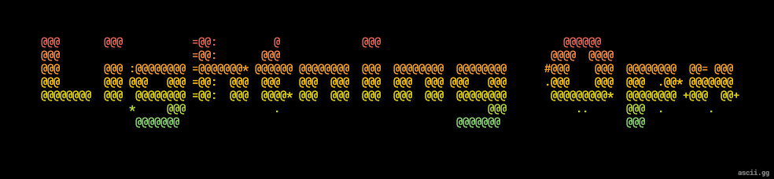

# lnd-ops



The Korean [LND Ops learning Wiki](https://s1ns3nz0.github.io/lnd-ops/) explains
how LND's state and failure model lead to this repository's Kubernetes,
observability, security, recovery, and constrained kagent design. Run it locally
with `npm ci && npm run docs:dev`; validate the production artifact with
`npm run docs:build`.

Reproducible Lightning node operator portfolio project for Mac arm64 Lima K3s and Windows WSL 2 K3s. Both run the same Helm chart with separate testnet wallets and a disposable regtest profile. The [demo execution plan](docs/demo-execution-plan.md) is the working path from the current state to the final portfolio demo. The [implementation roadmap](docs/implementation-roadmap.md) defines the MVP, multi-platform images, and repeat-deployment contract. The [operator plan](docs/operator-plan.md) records the target architecture, while the [observability plan](docs/observability-plan.md) records dashboards, alerts, and runbook priorities. The [regtest runbook](docs/regtest-runbook.md) covers the manual wallet and channel exercise. The [Windows runbook](docs/windows-runbook.md) is the exact Windows 11 Home acceptance path.

Phase 7 uses a fixed operator-selected Ollama server rather than assuming the
model runs on either Kubernetes host. The [Phase 7 runbook](docs/phase7-runbook.md)
defines the server contract, constrained kagent tools, one allowlisted probe
restart, audit and cooldown controls, and the live acceptance commands.

## Windows 11 Home quick start

First, open an elevated PowerShell window. Git must be available for this initial clone.

```powershell
cd $HOME
git clone https://github.com/s1ns3nz0/lnd-ops.git
cd lnd-ops
Set-ExecutionPolicy -Scope Process Bypass
.\ops\windows-enable-wsl.ps1
```

If the last command exits `10`, restart Windows if requested, open Ubuntu once and create its Linux user, close Ubuntu, and rerun the PowerShell command. Then open Ubuntu and run:

```sh
git clone https://github.com/s1ns3nz0/lnd-ops.git ~/src/lnd-ops
cd ~/src/lnd-ops
ops/windows-install-prereqs
```

If prerequisite installation exits `10`, close Ubuntu, run `wsl --shutdown` in PowerShell, reopen Ubuntu, and continue:

```sh
cd ~/src/lnd-ops
ops/doctor
ops/windows-smoke 2>&1 | tee windows-smoke.log
```

Success ends with `OK: Windows WSL 2 infrastructure smoke test passed`. Fresh wallet-free nodes are reported as `PENDING`; follow the [Windows runbook](docs/windows-runbook.md) for wallet, SCB, encryption, redeployment, and evidence steps.

## Current operator slice

The regtest, testnet, and monitoring infrastructure slices are implemented on Mac arm64 and Windows WSL 2 amd64. The Mac regtest wallet, channel, bidirectional payment, SCB, and [seed-plus-SCB recovery exercise](docs/evidence/mac-regtest-recovery-2026-09-23.md) passed. The Windows regtest wallet, channel, bidirectional payment, encrypted SCBs, live monitoring, and wallet-preserving redeployment also [passed](docs/evidence/windows-regtest-mvp-2026-09-23.md). Independent Mac and Windows testnet nodes then passed with external peers, active public channels, bidirectional payments, live monitoring, Pod restart recovery, current encrypted SCBs, wallet-preserving redeployment, Kubernetes security controls, and [cross-platform Phase 8 acceptance](docs/evidence/phase8-cross-platform-2026-09-24.md). The post-MVP path through the final public demonstration is defined in the [portfolio demo roadmap](docs/portfolio-demo-roadmap.md).

Start the Phase 9 rehearsal with `ops/demo`. It presents seven color-coded
cumulative stages, asks which final stage to run, and writes a private,
secret-free result. Use `ops/demo --to 7 --dry-run` to preview the complete
sequence. See the [Phase 9 demo runbook](docs/phase9-demo-runbook.md).

Use `ops/demo cleanup --dry-run` to inspect owned transient residue and
`ops/demo cleanup` to remove it, restore the regtest peer policy, and verify the
channel. Evidence and wallet-free environment deletion use separate explicit
subcommands documented in the runbook; funded wallets and PVCs are never part
of the default cleanup.

The [clean-start runbook](docs/clean-start-runbook.md) gives the guarded deletion, fresh deployment, repeat deployment, and evidence procedure for both target hosts. Both target hosts have completed their Phase 8 runtime proof.

The [image platform check](docs/evidence/image-platforms-2026-09-22.md) verifies every rendered project and monitoring image reference against its locked OCI index and both target CPU architectures.

Prerequisites: on Mac, Docker with Buildx, Helm 4, kubectl, Python 3, skopeo, virtualization, and at least 80 GiB free for the project VM. On Windows, WSL 2 Ubuntu with systemd, sudo, Docker with Buildx, Helm 4, kubectl, Python 3, and skopeo. `ops/doctor` reports missing tools. `ops/bootstrap` installs pinned K3s and creates a Mac Lima VM when needed; if the pinned Lima CLI is absent, it downloads and verifies the exact release archive. The WSL path has passed the infrastructure and regtest functional acceptance checks on the target PC.

Before putting funds into a testnet wallet, run `ops/check-host-encryption --check-only`, record the host disk-encryption recovery key independently of that host, then run `ops/check-host-encryption --confirm-recovery-key-recorded`. Do not save the key in the repository, WSL filesystem, shell history, screenshots, or the encrypted machine alone. The script verifies active FileVault and the Lima data location on Mac. From WSL it finds the current distribution's Windows backing volume, requires WSL 2, and checks that volume's protection without reading the recovery key. Exit `10` means encryption passed while recovery-key confirmation remains pending. The [Mac encryption evidence](docs/evidence/mac-host-encryption-2026-09-23.md) records that pending state.

The wallet seed, wallet password, SCB, SCB encryption passphrase, and macaroons have separate roles. The seed recreates on-chain wallet keys, the password unlocks the local wallet database, the SCB supports channel data-loss recovery, its GPG passphrase protects the off-PVC backup, and macaroons authorize RPC operations. The [testnet runbook](docs/testnet-runbook.md#wallet-and-recovery-material) defines their recovery boundaries and storage rules.

```sh
ops/doctor
ops/check-images
ops/bootstrap
export KUBECONFIG="${XDG_STATE_HOME:-$HOME/.local/state}/lnd-ops/kubeconfig"
ops/deploy regtest
ops/verify regtest
ops/deploy-monitoring
ops/verify-monitoring --infrastructure-only
```

After wallets, the active channel, recent bidirectional payments, both SCB copies, live monitoring, and a passing wallet-preserving redeploy proof exist, run the read-only Phase 0 gate:

```sh
ops/acceptance regtest
```

It exits `0` only when the complete regtest state still matches passing redeploy evidence from the last 24 hours, exits `10` for a missing manual or one-hour payment freshness gate, and exits `1` for a broken invariant or malformed evidence. The payment gate correlates each node's successful payment hash with the other node's settled invoice. A passing run writes a private `0600` JSON result under `${XDG_STATE_HOME:-$HOME/.local/state}/lnd-ops/evidence/` without running payments, changing channels, creating backups, or redeploying workloads.

`ops/verify regtest` exits `10` while wallet creation or unlock is pending. Follow the [regtest runbook](docs/regtest-runbook.md) for that manual gate; afterward, `ops/exercise-regtest` can mine disposable coins, open a channel, and verify fresh payments in both directions. Its success path awaits wallet creation. `ops/reset-disposable regtest|testnet --confirm-unfunded` removes the selected namespace and its PVCs only while every wallet in that profile is absent. It must not be used for a funded node. Management access uses the local kubeconfig; no public Kubernetes endpoint or LND service is configured.

For a disposable wallet-free clean-start proof, remove the Mac Lima VM or uninstall Windows K3s first, then run `ops/reset-project-image-cache --confirm-cluster-removed`. It fails closed when it cannot prove cluster absence and refuses remote Docker contexts. Once wallets exist, preserve and reuse their PVCs; prove ordinary deployment by comparing identity and state before and after chart reapplication. Docker Buildx layers and upstream registry cache remain reusable; project collector and verified-base tags are absent at the successful reset command's completion.

After the regtest channel and both host SCBs exist, the same runbook covers `ops/prepare-regtest-recovery` and `ops/verify-regtest-recovery`. Preparation stops original `lnd-0` before creating a fresh recovery PVC and copying its SCB. The operator restores the original seed interactively. The [Mac recovery exercise](docs/evidence/mac-regtest-recovery-2026-09-23.md) completed with the original node identity, DLP force-close, and recovered on-chain funds.
After a passing recovery, `ops/finish-regtest-recovery --preserve-original-wallet` retires the recovered copy before restarting the preserved original PVC. The operator then unlocks the original wallet interactively; no second wallet creation is required.
If the original aezeed is unavailable or recovery verification fails, use
`ops/abort-regtest-recovery --preserve-original-wallet`; it checks the recorded
PVC UID, removes only the disposable recovery copy, and resumes the preserved
original wallet without creating recovery evidence.

Phase 5 adds `ops/exercise-backup-alert` and `ops/phase5-acceptance`. The alert
exercise proves the live SCB freshness metric, five-minute production alert,
Alertmanager delivery, runbook, and restored healthy metric without modifying
backup bytes. The acceptance gate requires owner-only isolated recovery
evidence, duplicate-identity prevention, the preserved original PVC, and
continued Phase 4 testnet operation.

Windows Phase 5 has passed with encrypted SCB verification, isolated
seed-plus-SCB recovery, DLP force close, confirmed on-chain fund recovery, live
backup-alert delivery and restoration, preserved original PVC resumption, and
Phase 4 continuity. See the
[Windows Phase 5 evidence](docs/evidence/windows-phase5-recovery-2026-09-24.md).
Windows full-volume encryption remains an explicit deferred limitation.

Phase 6 uses `ops/exercise-phase6-faults` to run three reversible live faults
without shortening the production alert durations: an inactive regtest channel
through temporary peer-policy denial, a disposable CrashLoop Pod, and an
authorized Falco runtime marker. Each scenario must produce its real metric or
event, fire through Alertmanager, reference its versioned runbook, restore the
fault, clear the alert, and pass a healthy post-check. Run
`ops/phase6-acceptance --acknowledge-host-encryption-deferred` after the private
fault evidence exists.

Windows Phase 6 has passed this complete flow for all three fault classes while
retaining Phase 5 continuity. See the
[Windows Phase 6 evidence](docs/evidence/windows-phase6-faults-2026-09-24.md).

Phase 7 installs pinned kagent with a fixed external Ollama endpoint and binds
only the project MCP gateway. Run `ops/deploy-agent` as described in the
[Phase 7 runbook](docs/phase7-runbook.md), then run
`ops/exercise-phase7-agent` and `ops/phase7-acceptance`. The Windows gate passed
with a real peer-isolation fault diagnosed by `gpt-oss:20b`, exact policy and
channel recovery, one audited probe restart, cooldown denial, forbidden
wallet-action denial, and negative RBAC checks. See the
[Windows Phase 7 evidence](docs/evidence/windows-phase7-kagent-2026-09-24.md).

After creating and unlocking a wallet, run `ops/deploy regtest --monitoring` or `ops/deploy testnet --monitoring` to enable lndmon and the payment collector. The command requires each node's read-only macaroon and a responding LND RPC before changing the chart. Helm mounts the collector source from a ConfigMap and runs it with a digest-pinned multi-architecture Python image, so Mac arm64 and Windows amd64 need no node-local image build or privileged K3s import. Adding sidecars rolls the Pod; unlock the wallet again if LND asks, then run `ops/verify <profile>` and `ops/verify-monitoring --profile <profile>`. Later ordinary `ops/deploy <profile>` invocations keep monitoring enabled.

After the testnet wallet has an open channel and `ops/backup-scb` has created its host copy, run `ops/redeploy-check`. It checks the node key, channel points, LND and Prometheus PVC UIDs, source and host SCB checksums, and the exact timestamp/value of a historical Prometheus sample before and after reapplying both charts. It also requires both Helm release revisions to advance. A passing run saves a private, secret-free JSON record under `${XDG_STATE_HOME:-$HOME/.local/state}/lnd-ops/evidence/`; use `--evidence NAME` to select a filename within that protected directory. Metric labels and the cluster UID are hashed so local target names and the raw cluster identifier are not recorded. It exits `10` before deploying if the manual wallet or channel gates are still pending. This checks ordinary chart reapplication; a separate recovery exercise must test Pod restart and wallet unlock.

`ops/verify-monitoring` without the infrastructure flag requires live testnet LND, wallet-state, lndmon, and payment collector scrapes plus recent outgoing and incoming payment samples by default; `--profile regtest` checks both regtest nodes. It exits `10` while wallet, scrape, or fresh payment gates are pending. The monitoring chart creates a 10 GiB Prometheus PVC and provisions six project dashboards plus Pod, disk, wallet, chain-sync, channel, liquidity, payment-failure, backup, and scrape alert rules from Git. A synthetic locked-wallet fixture reached Alertmanager and suppressed dependent alerts; Phase 8 validated the dashboards against live LND data, while a real wallet-lock alert remains unexercised. A canceled invoice is not a failed incoming payment, so receive-failure observability remains open. The monitoring namespace uses privileged Pod Security Admission because node exporter mounts host paths. See [Mac monitoring evidence](docs/evidence/mac-stage4-infrastructure-2026-09-22.md) for the earlier infrastructure-only proof and [Phase 8 evidence](docs/evidence/phase8-cross-platform-2026-09-24.md) for the completed live proof.

After the testnet wallet is unlocked and its encrypted SCB is current, run `ops/phase3-acceptance` from a clean checkout. The gate makes no Kubernetes or LND changes: it keeps the Phase 1 continuity check passing, executes every dashboard PromQL query against live data, verifies all required alert rules and runbook links, and writes a private owner-only JSON result under `${XDG_STATE_HOME:-$HOME/.local/state}/lnd-ops/evidence/`. Exit `0` is a pass, `10` identifies a required operator action, `1` is a failed invariant, and `2` is invalid invocation. It uses an existing `KUBECONFIG` when set, otherwise the project kubeconfig in the state directory.

Install and validate the Phase 4 security baseline with:

```sh
ops/deploy-security
ops/verify-security
ops/phase4-acceptance
```

The security deployment uses vendored, checksummed Kyverno and Falco charts. A Helm 4 post-renderer pins their runtime images to verified linux/amd64 and linux/arm64 OCI digests. The acceptance gate proves admission allow/deny decisions, token-free RBAC, real NetworkPolicy isolation, a modern eBPF Falco event reaching Alertmanager, live LND certificate expiry, and continued Phase 3 operation. See [the security baseline](docs/security-baseline.md).

The Windows Phase 4 gate passed with all 57 dashboard queries and 16 alert
rules live; see the [secret-free security evidence](docs/evidence/windows-phase4-security-2026-09-24.md).

## Repository harness

A small, repository-local harness for predictable Codex work. It keeps only
the rules that affect delivery: MVP first, focused discovery, portable tests,
and a short final review.

## Flow

1. Build the smallest testable slice first.
2. Use Graft to find the relevant code and make the change.
3. Run the relevant test or check.
4. For code, configuration, or user-visible behavior, do a short `sip` and
   fresh-context `shower` review.
5. Summarize the result concisely.

`$grill-me` runs before work only when a request can change product design,
security, an external integration, data, irreversible state, or external
state. Uploads, formatting, pushes, and merges do not need it.

## Setup

Requires Node.js 20 or newer.

```sh
npm run harness:init
npm run harness:check
npm test
```

`harness.config.json` is the machine-readable policy. Its active project adapter
runs Bash/Python/JSON syntax checks, discovered Python and Node unit tests, and
the configured Helm lint/render matrix with:

```sh
npm run harness:verify
```

This command requires Python 3.11+, Node 20+, and Helm 4. Registry platform
inspection, container builds, Kubernetes schema/install checks, and runtime
behavior remain separate CI or live-cluster checks.

The agent environment provides Graft, `$grill-me`, `sip`, and `shower`; this
template does not install or wrap those skills. `harness:check` validates the
policy, while `harness:verify` also runs the active adapter commands.

Required tests must run on Linux and be vendor-neutral. New applications and
deployable artifacts run their relevant tests in a maintained Linux Docker
image selected for the project's runtime; use a digest when available.
Building or testing an image does not authorize pushing it or deploying.

## Safety

Work stays inside the repository. Publishing, merging, deployment, secret
changes, production access, and third-party contact require explicit task
authorization.
