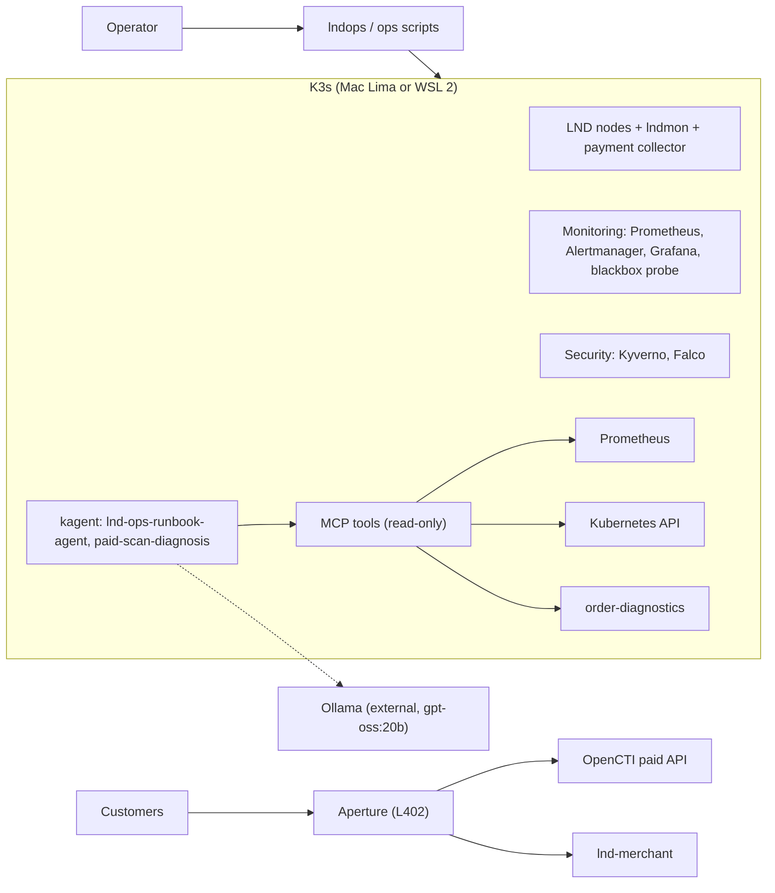

# lnd-ops

```text
__                      __       ______
|  \                    |  \     /      \
| ▓▓      _______   ____| ▓▓    |  ▓▓▓▓▓▓\ ______   _______
| ▓▓     |       \ /      ▓▓    | ▓▓  | ▓▓/      \ /       \
| ▓▓     | ▓▓▓▓▓▓▓\  ▓▓▓▓▓▓▓    | ▓▓  | ▓▓  ▓▓▓▓▓▓\  ▓▓▓▓▓▓▓
| ▓▓     | ▓▓  | ▓▓ ▓▓  | ▓▓    | ▓▓  | ▓▓ ▓▓  | ▓▓\▓▓    \
| ▓▓_____| ▓▓  | ▓▓ ▓▓__| ▓▓    | ▓▓__/ ▓▓ ▓▓__/ ▓▓_\▓▓▓▓▓▓\
| ▓▓     \ ▓▓  | ▓▓\▓▓    ▓▓     \▓▓    ▓▓ ▓▓    ▓▓       ▓▓
 \▓▓▓▓▓▓▓▓\▓▓   \▓▓ \▓▓▓▓▓▓▓      \▓▓▓▓▓▓| ▓▓▓▓▓▓▓ \▓▓▓▓▓▓▓
                                         | ▓▓
                                         | ▓▓
                                          \▓▓

▓▓▓▓▓▓▓▓▓▓▓▓▓▓▓▓▓▓▓▓▓▓▓▓▓▓▓▓▓▓▓▓▓▓▓▓▓▓▓▓▓▓▓▓▓▓▓▓▓▓▓▓▓▓▓▓▓▓▓▓▓▓
░░░░░░░░░░░░░░░░░░░░░░░░░░░░░░░░░░░░░░░░░░░░░░░░░░░░░░░░░░░░░░
••••••••••••••••••••••••••••••••••••••••••••••••••••••••••••••
```

Reproducible Lightning (LND) node operations on Kubernetes (K3s on Mac arm64 via Lima and Windows WSL 2), with monitoring, security, backup/recovery, and a constrained AI incident-diagnosis agent (kagent) for an L402 paid API.

Korean learning wiki: <https://s1ns3nz0.github.io/lnd-ops/>

## What it does

- LND testnet/regtest nodes from one Helm chart on both hosts; wallet-preserving redeploys; encrypted SCB backups; seed-plus-SCB recovery.
- Observability: Prometheus, Grafana dashboards, Alertmanager rules, each alert linked to a runbook or playbook.
- Security baseline: Kyverno admission, Falco runtime detection, NetworkPolicy isolation, token-free RBAC, digest-pinned images.
- AI diagnosis with kagent: read-only MCP tools, allowlisted queries, human approval for every action.
- L402 payment-gate SRE (Aperture): 99.5% probe SLO with multiwindow burn-rate alerts, Google-SRE-style playbooks, a rehearsal lab with fault injection, and an automated agent eval.

## Architecture


```mermaid
flowchart LR
  Op[Operator] --> Ops["lndops / ops scripts"] --> K3s
  subgraph K3s["K3s (Mac Lima or WSL 2)"]
    LND["LND nodes + lndmon + payment collector"]
    Mon["Monitoring: Prometheus, Alertmanager, Grafana, blackbox probe"]
    Sec["Security: Kyverno, Falco"]
    KA["kagent: lnd-ops-runbook-agent, paid-scan-diagnosis"]
    KA --> MCP["MCP tools (read-only)"]
    MCP --> Prom[Prometheus]
    MCP --> KAPI[Kubernetes API]
    MCP --> OD[order-diagnostics]
  end
  KA -.-> Oll["Ollama (external, gpt-oss:20b)"]
  Cust[Customers] --> Ap["Aperture (L402)"] --> OC[OpenCTI paid API]
  Ap --> Mer[lnd-merchant]
```

## Proven

| Area | Result | Evidence |
| --- | --- | --- |
| Cross-platform testnet nodes | Independent Mac and Windows nodes with external peers, active public channels, bidirectional payments | [phase8](docs/evidence/phase8-cross-platform-2026-09-24.md) |
| Recovery | Seed-plus-SCB recovery with DLP force close and recovered on-chain funds (Mac regtest, Windows) | [Mac](docs/evidence/mac-regtest-recovery-2026-09-23.md), [Windows](docs/evidence/windows-phase5-recovery-2026-09-24.md) |
| Security | Admission allow/deny, NetworkPolicy isolation, Falco event to Alertmanager; 57 dashboard queries and 16 alert rules live | [phase4](docs/evidence/windows-phase4-security-2026-09-24.md) |
| Fault drills (LND) | Three reversible live faults each fired, linked a runbook, restored and cleared | [phase6](docs/evidence/windows-phase6-faults-2026-09-24.md) |
| kagent (LND) | gpt-oss:20b diagnosed a real peer-isolation fault; audited restart, cooldown and forbidden-action denial | [phase7](docs/evidence/windows-phase7-kagent-2026-09-24.md) |
| L402 detection (lab) | Probe burn-rate alert paged in 5 min 14 s vs 16 min 22 s for the counter alert (pricer outage) | [SLO](docs/slo-l402.md) |
| L402 drill (lab) | Invoice-failure drill: paged in 2 min 21 s; recovery verified by new invoices 1 min 42 s after the fix, 28 min before the last alert cleared | [drill 2](docs/evidence/drill2-invoice-failure-2026-09-30.md) |
| AI diagnosis eval (lab) | 47% to 72-80% pass rate (5 scenarios x 5 runs, gpt-oss:20b). Known limit: invents component names when evidence is missing, so a human reviews every answer. Lesson: facts in tool output beat prompt rules | [eval](docs/paid-scan-diagnosis.md) |

Lab = local kind rehearsal cluster with synthetic Aperture metrics; production rollout pending.

## Quick start

Mac (arm64):

```sh
ops/doctor
ops/bootstrap
export KUBECONFIG="${XDG_STATE_HOME:-$HOME/.local/state}/lnd-ops/kubeconfig"
ops/deploy regtest
ops/verify regtest
ops/deploy-monitoring
```

Run `./lndops` for the interactive setup shell. Windows WSL 2, wallets, and acceptance gates: see the [operator guide](docs/operator-guide.md).

## Docs map

| Topic | Doc |
| --- | --- |
| Operator guide | [docs/operator-guide.md](docs/operator-guide.md) |
| Windows | [docs/windows-runbook.md](docs/windows-runbook.md) |
| Testnet / wallet material | [docs/testnet-runbook.md](docs/testnet-runbook.md) |
| Regtest | [docs/regtest-runbook.md](docs/regtest-runbook.md) |
| Observability | [docs/observability-plan.md](docs/observability-plan.md) |
| Security | [docs/security-baseline.md](docs/security-baseline.md) |
| LND alert runbooks | [docs/runbooks/](docs/runbooks/) |
| L402 playbooks | [docs/playbooks/](docs/playbooks/) |
| L402 SLO | [docs/slo-l402.md](docs/slo-l402.md) |
| Rehearsal drills | [docs/rehearsal-drills.md](docs/rehearsal-drills.md) |
| kagent | [Phase 7 runbook](docs/phase7-runbook.md), [paid-scan diagnosis](docs/paid-scan-diagnosis.md) |
| Demo | [docs/phase9-demo-runbook.md](docs/phase9-demo-runbook.md) |

## Safety

Agents are read-only. Wallets, funding, secrets, recovery, and fault injection are explicit manual gates.
No public Kubernetes or LND endpoint is configured.
Publishing, merging, deployment, and secret changes require explicit authorization.
